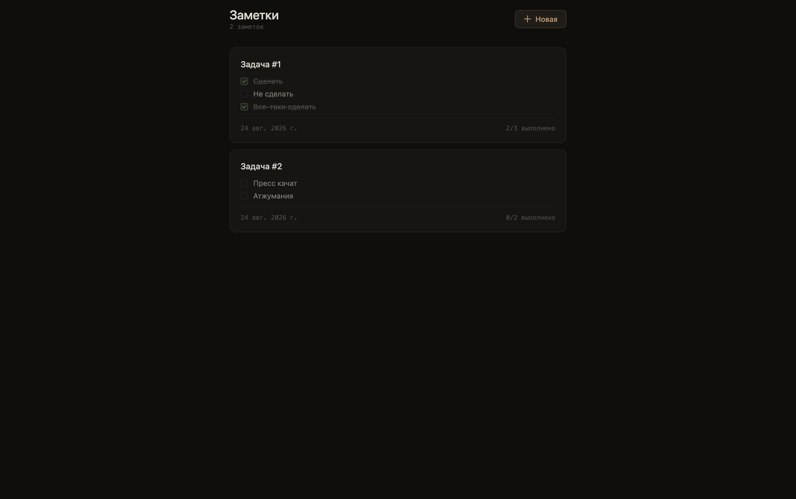

# Todo Notes

> Тестовое задание — SPA-приложение для заметок с задачами

**Максим Чуприн**, август 2026

<p align="center">
  <a href="https://mchuprin.github.io/nuxt-test-todo-1/">
    <strong>Demo &rarr;</strong>
  </a>
</p>

<p align="center">
  
</p>

<p align="center">
  
  
  
  
  
  
  
  
</p>

<p align="center">
  <a href="./README.en.md">English</a>
</p>

---

## Задача

Создать SPA-приложение для заметок с задачами (todo). Ключевые требования:

- Undo/redo история редактирования
- Автосохранение черновиков
- Устойчивость к одновременной работе во нескольких вкладках

## Стек

| Слой | Технология |
|------|-----------|
| Framework | Nuxt 4.5 (SPA) |
| UI | Vue 3.5 + Composition API |
| Состояние | Pinia 4.0 |
| Стили | SCSS (без UI-библиотек) |
| Типизация | TypeScript strict |
| Линтер | Biome |
| Тесты | Vitest + jsdom |
| Контейнеры | Docker + nginx |
| CI/CD | GitHub Actions &rarr; GitHub Pages |

## Структура проекта

```
app/
├── pages/
│   ├── index.vue                  # Список заметок
│   └── note/[id].vue              # Редактирование заметки
├── layouts/
│   ├── default.vue                # Список заметок
│   └── note.vue                   # Редактор + undo/redo кнопки
├── middleware/
│   └── note-resolve.ts            # Резолв ID заметки + guard
├── components/
│   ├── app/
│   │   ├── Button.vue
│   │   ├── Input.vue
│   │   └── Modal.vue
│   └── note/
│       ├── Card.vue               # Карточка в списке
│       └── TodoItem.vue           # Элемент todo
├── composables/
│   ├── useHistory.ts              # Undo/redo (чистые функции + реактивность)
│   └── useNoteEditor.ts           # Вся логика редактирования
├── stores/
│   └── notes.ts                   # Pinia стор (CRUD, сортировка)
├── types/
│   └── index.ts                   # HistoryDelta, Note, TodoItem
├── utils/
│   └── storage.ts                 # localStorage helpers
└── styles/
    ├── _variables.scss
    └── styles.scss
```

## Подход и решения

### Nuxt 4 SPA вместо SSR

Приложение полностью клиентское — нет серверных данных, авторизации, SEO. SSR добавил бы сложность без пользы. Nuxt chosen за автоимпорты, file-based routing и встроенную интеграцию с Pinia.

### Pinia вместо localStorage напрямую

Стор централизует CRUD-логику и отделяет бизнес от представления. localStorage — только persistence-слой через отдельный `useStorage` composable.

### Undo/redo через чистые функции + composable

История — массив `HistoryDelta` объектов. `applyDelta` и `reverseDelta` — чистые функции, легко тестируются. Composable добавляет реактивность (ref, computed, watchEffect) поверх них. Ограничение 50 шагов — компромисс между полнотой истории и потреблением памяти.

```
HistoryDelta =
  | { type: 'title', before, after }
  | { type: 'todo-check', id, before, after }
  | { type: 'todo-add', item, index }
  | { type: 'todo-delete', item, index }
  | { type: 'todo-text', id, before, after }
```

Триггеры: title и todo-text сохраняют на blur, add/check/delete — сразу.

### Cross-tab safety через `storage` event

Браузер шлёт событие `storage` при изменениях в другом tab. Страница заметки слушает это событие и синхронизирует стор. Если заметка удалена в другой вкладке — показывается модальное окно вместо крэша.

### Тестирование

49 unit-тестов покрывают:

| Модуль | Тестов | Что покрыто |
|--------|--------|-------------|
| `useHistory` | 20 | applyDelta, reverseDelta, composable |
| `notes store` | 15 | CRUD, сортировка, edge-cases |
| `useStorage` | 14 | черновики, pending notes, версия схемы |

## Возможности

- CRUD заметок (создание, редактирование, удаление)
- Undo/redo история (50 шагов, Ctrl+Z / Ctrl+Shift+Z)
- Автосохранение черновиков + восстановление при загрузке
- Cross-tab safety (модалка при удалении заметки в другой вкладке)
- Модальные окна с подтверждением (удаление, отмена редактирования)
- Edge-cases: прямой URL несуществующей заметки, пустые поля, null/undefined
- TypeScript strict, Biome linting
- Docker + docker-compose (multi-stage: node &rarr; nginx)
- GitHub Pages CI/CD через GitHub Actions

## Ограничения

- **Нет e2e-тестов** — Vitest покрывает логику, но не пользовательские сценарии. Следующий шаг: Playwright.
- **Нет PWA** — Service Worker не подключен. Offline-first работает через localStorage, но нет манифеста и установки на рабочий стол.
- **Нет серверной синхронизации** — данные только в localStorage. Для multi-device нужен бэкенд.

## Запуск

### Docker

```bash
docker compose up
# http://localhost:3000
```

### Разработка

```bash
pnpm install
pnpm dev
# http://localhost:3000
```

### Тесты и линтер

```bash
pnpm test    # 49/49 green
pnpm lint    # biome check
```
